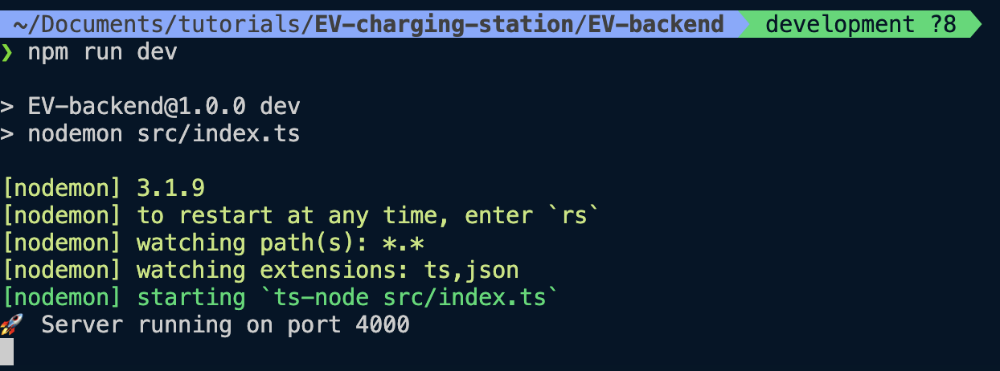

### Task 2b: Backend

This project was setup using Node.js + Express + TypeScript + Prisma + Postgresql.

### How to run

- Run `docker-compose up -d` in root of the project directory, to kickstart the Postgresql database.
- Rename .env.example to .env and fill in the values.
- Run following commands:

```bash
cd EV-backend
npm install
npm run prisma:migrate
npm run dev
```

After successful run, your terminal should look like this:



### Resetting the database

If you are willing to reset the database, you can run `npm run prisma:reset`.

<br>
<br>
<br>
<br>

<hr>

<br>
<br>
<br>
<br>

### CURL requests

- Create Simulation Configuration

```bash
curl -X POST http://localhost:4000/api/simulation/config -H "Content-Type: application/json" -d '{
  "chargePoints": 20,
  "arrivalMultiplier": 20,
  "carConsumption": 18,
  "chargingPower": 11
}'
```

- Get a Simulation Configuration

```bash
curl http://localhost:4000/api/simulation/config/1
```

- Get All Simulation Configurations

```bash
curl http://localhost:4000/api/simulation/config
```

- Delete a Simulation Configuration

```bash
curl -X DELETE http://localhost:4000/api/simulation/config/1
```

- Run a Mock Simulation

```bash
curl -X POST http://localhost:4000/api/simulation/1 -H "Content-Type: application/json"
```

- Get All Simulations Results

```bash
curl http://localhost:4000/api/simulation
```

- Get a Simulation Result

```bash
curl http://localhost:4000/api/simulation/1
```

- Get All Charging Events for a Simulation

```bash
curl http://localhost:4000/api/simulation/1/charging-events
```
