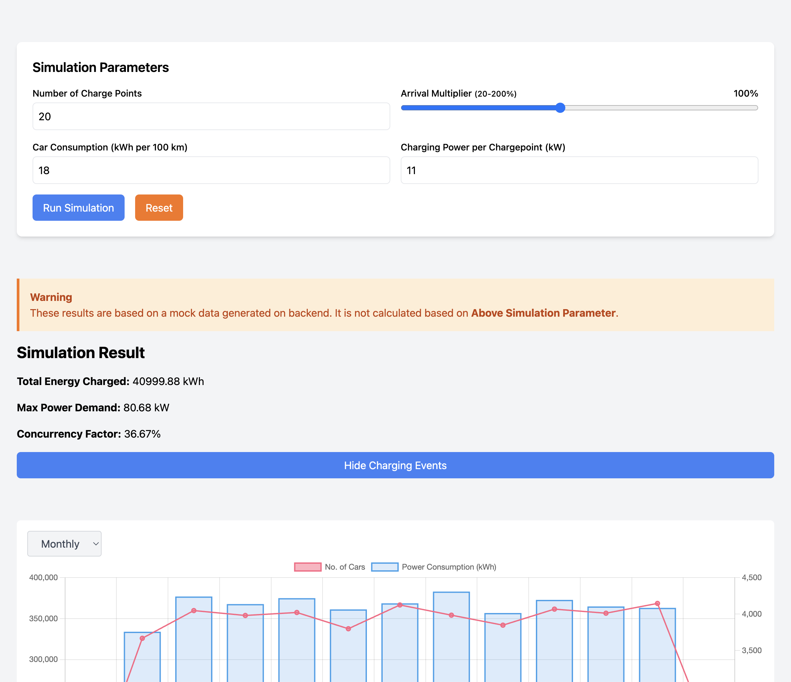

## Task 2a: Frontend

This project was setup using React + TypeScript + Vite

### How to run

First rename .env.example to .env and fill in the values. After that, run following commands:

```bash
cd EV-client
npm install
npm run dev
```

After successful run, you should see a page like this:


