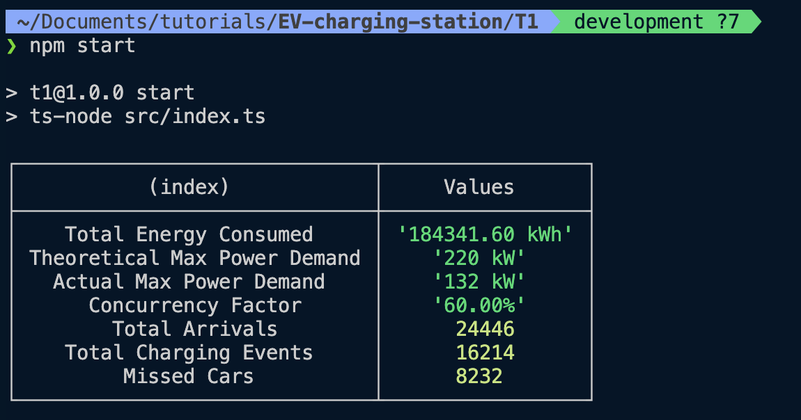

### Task 1

#### How to run

```bash
cd T1
npm install
npm start
```

output should look like this:



### Script Logic

1. Run loop for total intervals
   1. 1 Interval = 15 minutes
   2. 1 hour = 4 intervals
   3. 1 total interval = 24 hours X 4 intervals X 365 days = 35040 intervals
2. Find current hour
3. Run loop for total charge points
4. Check if car arrives at a charge point at a given hour
5. If car arrives and charge point is available
   1. Generate charging demand
   2. Calculate charging time
   3. Update charge point status
   4. Update current power demand
   5. Update total energy consumed
6. else check if charging point is occupied
   1. Reduce the time left for charging
   2. If time left is greater than 0, add power needed for charging to current power demand
   3. If time left is 0, set charge point status to null

### For Logic for DST

- I will find the current day of the year
- I will check if the current day of the year is in the DST range
- If it is, I will add 1 hour to the day
- Or I will remove 1 hour from the day

That means If DST is active, there will be 4 more intervals in a day.
